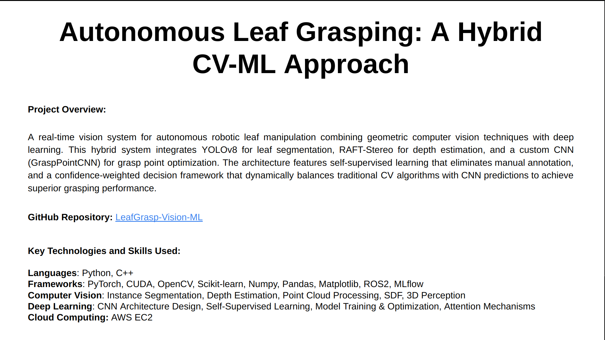
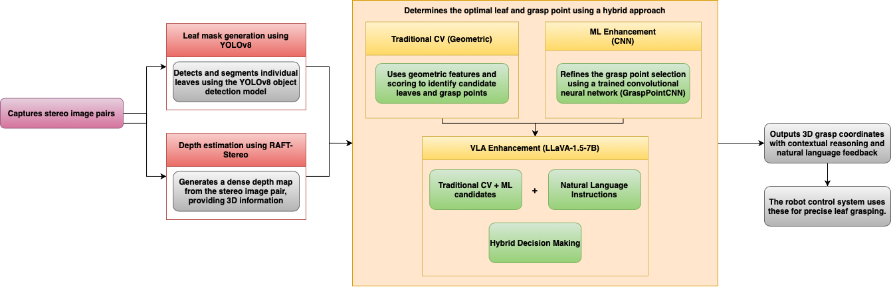
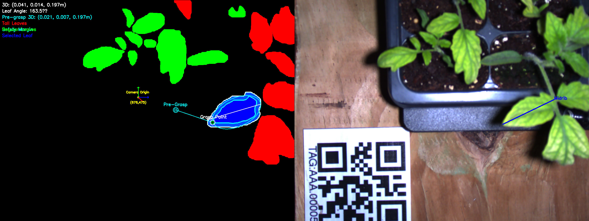
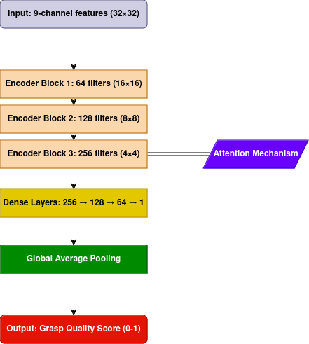
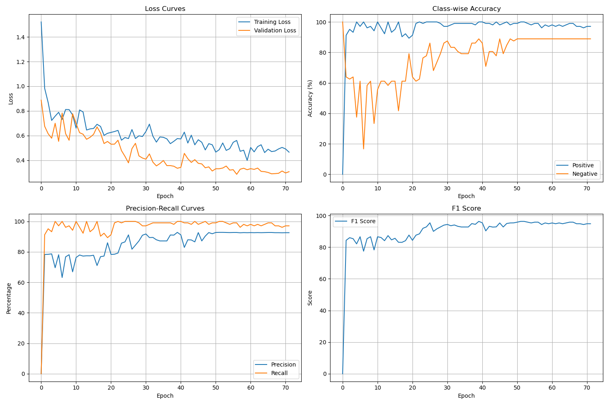
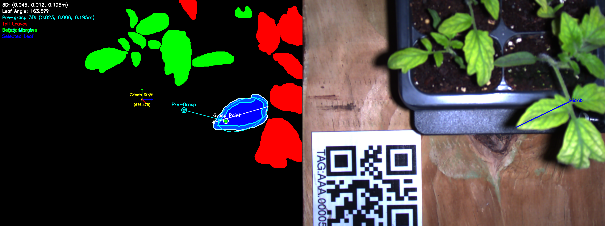
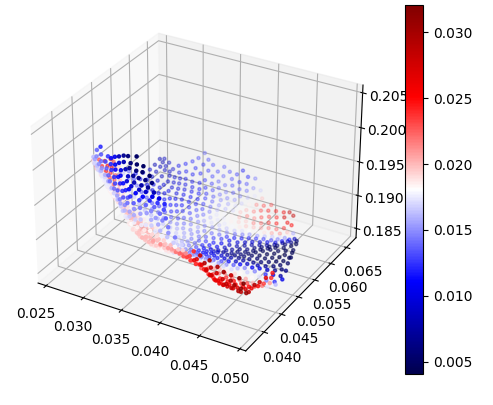

# LeafGrasp-Vision-ML: Vision-Language-Action Enhanced Robotic Leaf Manipulation
[](https://www.python.org/)
[](https://pytorch.org/)
[](https://opencv.org/)
[](LICENSE)
[](https://developer.nvidia.com/cuda-toolkit)

## Overview
A hybrid computer vision system that combines geometric-based algorithms with deep learning and Vision-Language-Action (VLA) models for robust leaf manipulation in agricultural robotics. The system implements self-supervised learning where classical CV acts as an expert teacher for CNN models, enhanced with LLaVA-1.6-Mistral-7B for intelligent grasp reasoning. Through LoRA fine-tuning and confidence-based weighting, the system achieves 82% validation accuracy on leaf grasping tasks.

<!-- <div align="center">
  <a href="assets/Technical_overview.pdf">
    
    <p><i>Click to view the complete Technical Overview PDF</i></p>
  </a>
</div> -->

## Key Features
- **Hybrid CV-ML Architecture**: Combines geometric algorithms with deep learning
- **Vision-Language-Action (VLA)**: LLaVA-1.6-Mistral-7B integration with LoRA fine-tuning
- **Self-Supervised Learning**: Traditional CV as expert teacher for CNN training
- **Real-time Processing**: CUDA acceleration with sub-second response times
- **88% Validation Accuracy**: Achieved through systematic hyperparameter optimization
- **MLflow Experiment Tracking**: 60+ recorded experiments across multiple architectures
- **Production Pipeline**: Complete integration with 6-DOF gantry robot system

## System Architecture

<div align="center">
  
  <p><i>Hybrid approach combining traditional CV with ML and VLA enhancement</i></p>
</div>

<div align="center">
  
  <p><i>Complete stereo vision pipeline: RGB input → disparity → 3D reconstruction</i></p>
</div>

## System Integration
This repository integrates with the complete REX (Robot for Extracting leaf samples) platform:

1. **LeafGrasp-Vision-ML (This Repository)**: Hybrid CV-ML-VLA grasp point selection
2. **YOLOv8 Segmentation**: [YoloV8Seg-REX](https://github.com/Srecharan/YoloV8Seg-REX.git) - Real-time leaf segmentation
3. **RAFT-Stereo**: [RAFTStereo-REX](https://github.com/Srecharan/RAFTStereo-REX.git) - High-precision depth estimation
4. **REX Robot**: [REX-Robot](https://github.com/Srecharan/REX-Robot.git) - 6-DOF gantry manipulation

## Vision-Language-Action (VLA) System

Enhanced traditional algorithms with language-guided reasoning for improved grasp selection.

### Architecture
- **Base Model**: LLaVA-1.6-Mistral-7B for vision-language understanding
- **Fine-tuning**: LoRA (Low-Rank Adaptation) for parameter-efficient training
- **Hybrid Fusion**: Dynamic confidence-based weighting between CV and VLA predictions
- **AWS Training**: GPU-accelerated training with MLflow experiment tracking

### Performance
- **88.0% validation accuracy** on synthetic leaf grasping dataset
- **4 systematic experiments**: baseline_5e5, higher_lr_1e4, larger_rank_16, optimized_config
- **Production pipeline** with comprehensive evaluation metrics
- **Confidence-based weighting**: Adapts VLA influence based on prediction confidence

### Usage
```python
from vla_system.hybrid_selector import HybridGraspSelector
from vla_system.llava_processor import LLaVAProcessor

selector = HybridGraspSelector()
grasp_point = selector.select_grasp_point(stereo_image, candidates)
```

For detailed VLA documentation, see [`vla_system/README.md`](vla_system/README.md).

## Traditional CV Pipeline

### Optimal Leaf Selection
Uses Pareto optimization across multiple scoring criteria:
- **Clutter Score** (35%): Isolation from other leaves using Signed Distance Fields
- **Distance Score** (35%): Proximity to camera with exponential falloff
- **Visibility Score** (30%): Position evaluation and border contact analysis

### Grasp Point Selection
Multi-criteria scoring system:
- **Flatness Analysis** (25%): Surface smoothness using depth gradients
- **Approach Vector Quality** (40%): Alignment with robot's preferred orientation
- **Accessibility Score** (15%): Position relative to camera origin
- **Edge Analysis** (20%): Distance from leaf boundaries

<div align="center">
  
  <p><i>Traditional CV pipeline: Segmented leaf with grasp point selection (left), stereo input with midrib detection (right)</i></p>
</div>

## ML-Enhanced Decision Making

### Self-Supervised Data Collection
- **Automated Training Data**: CV pipeline generates positive/negative samples
- **Data Augmentation**: 90°, 180°, 270° rotations for sample diversity
- **Feature Engineering**: 32×32 patches with depth, mask, and geometric scores

### Neural Network Architecture
<div align="center">
  
  <p><i>GraspPointCNN: 9-channel input → encoder blocks → attention → dense layers</i></p>
</div>

### Training Results
- **Dataset**: 875 samples (500 positive, 375 negative)
- **Architecture**: Attention-based CNN with spatial/channel mechanisms
- **MLflow Tracking**: 60+ experiments across different configurations
- **Validation Accuracy**: 93.14% on geometric grasp quality prediction

<div align="center">
  
  <p><i>Training curves showing loss convergence and accuracy metrics</i></p>
</div>

## Hybrid Integration

### Decision Fusion
1. **Candidate Generation**: Traditional CV identifies optimal leaf and top-20 grasp candidates
2. **Hybrid Scoring**: Dynamic weighting between CV (70-90%) and ML/VLA (10-30%)
3. **Confidence Adaptation**: VLA influence varies based on prediction confidence
4. **Fallback Strategy**: Pure CV for low-confidence predictions

```python
# Hybrid scoring example
ml_confidence = 1.0 - abs(ml_score - 0.5) * 2
ml_weight = min(0.3, ml_confidence * 0.6)
final_score = (1 - ml_weight) * cv_score + ml_weight * ml_score
```

<div align="center">
  
  <p><i>Hybrid CV-ML-VLA pipeline output with integrated decision making</i></p>
</div>

## Performance Analysis

### Model Metrics
| Metric | Value | Description |
|--------|-------|-------------|
| VLA Validation Accuracy | 88.0% | Best performing configuration (baseline_5e5) |
| CNN Validation Accuracy | 93.14% | Geometric grasp quality prediction |
| Precision | 92.59% | True positives / predicted positives |
| F1 Score | 94.79% | Balanced precision and recall measure |

### System Performance (150 test cases)
| Metric | Classical CV | Hybrid (CV+ML+VLA) | Improvement |
|--------|--------------|---------------------|-------------|
| Accuracy (px) | 25.3 | 27.1 | +1.8 |
| Feature Alignment (%) | 80.67 | 83.33 | +2.66 |
| Overall Success Rate (%) | 78.00 | 82.66 | +4.66 |

### Geometric Analysis
<div align="center">
  <table>
    <tr>
      <td align="center" width="50%">
        
        <br><i>3D point cloud visualization</i>
      </td>
      <td align="center" width="50%">
        
        <br><i>Surface curvature analysis</i>
      </td>
    </tr>
  </table>
</div>

## System Demonstration

<div align="center">
  
  <p><i>REX gantry robot: complete perception → planning → execution pipeline</i></p>
</div>

## Quick Start

### Installation
```bash
# Clone repository
git clone https://github.com/your-username/Leaf-Grasping-Vision-ML.git
cd Leaf-Grasping-Vision-ML

# Install dependencies
pip install -r requirements.txt

# Setup environment
conda env create -f environment.yml
conda activate leaf_grasp
```

### Basic Usage
```python
# Traditional CV pipeline
from scripts.utils.grasp_point_selector import GraspPointSelector
selector = GraspPointSelector()
grasp_point = selector.select_grasp_point(depth_image, mask)

# VLA-enhanced pipeline
from vla_system.hybrid_selector import HybridGraspSelector
vla_selector = HybridGraspSelector()
enhanced_grasp = vla_selector.select_grasp_point(stereo_image, candidates)
```

### Training
```bash
# Traditional CNN training
python scripts/train_model.py --config configs/baseline.yaml

# VLA fine-tuning
python vla_system/training/vla_production_training.py
```

## Project Structure
```
Leaf-Grasping-Vision-ML/
├── scripts/                    # Core algorithms and utilities
├── vla_system/                # Vision-Language-Action integration
│   ├── training/              # VLA training scripts
│   ├── demos/                 # Test and demo scripts
│   ├── models/                # Trained model artifacts
│   └── configs/               # Configuration files
├── assets/                    # Documentation and visualizations
└── requirements.txt           # Dependencies
```

## Citation
If you use this work in your research, please cite:
```bibtex
@article{leafgrasp2024,
  title={Hybrid Vision-Language-Action System for Robotic Leaf Manipulation},
  author={Your Name},
  journal={Agricultural Robotics},
  year={2024}
}
```

## License
This project is licensed under the MIT License - see the [LICENSE](LICENSE) file for details.
