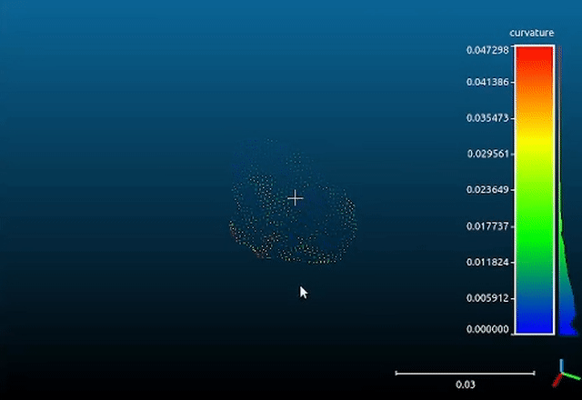

# LeafGrasp-Vision-ML: ML-Enhanced Computer Vision System for Robotic Leaf Manipulation
[](https://www.python.org/)
[](https://pytorch.org/)
[](https://opencv.org/)
[](LICENSE)
[](https://developer.nvidia.com/cuda-toolkit)

## Overview
A hybrid computer vision system that combines geometric-based algorithms with deep learning for robust leaf manipulation in agricultural robotics. The system implements a novel self-supervised learning approach where classical CV acts as an expert teacher for a CNN model, enabling adaptive grasp point selection. Integrated with a 6-DOF gantry robot, it achieves high-precision leaf detection and manipulation through real-time depth estimation, instance segmentation, and optimal grasp planning.

## 1-min Overview

<div align="center">
  <a href="https://youtu.be/eRFWZjJbcgI  #remove">
    
    <br>
    
  </a>
  <br><br>
  <em>Technical overview of LeafGrasp-Vision's architecture and implementation</em>
</div>

## Key Features
- Hybrid architecture combining geometric-based CV with deep learning
- Self-supervised learning leveraging traditional CV expertise
- Real-time processing with CUDA acceleration
- Multi-stage perception pipeline (YOLOv8 segmentation + RAFT stereo)
- Attention-based CNN for optimal grasp point selection
- Integrated with 6-DOF gantry robot control system
- High-precision depth estimation and 3D reconstruction
- Automated data collection and continuous learning pipeline

## System Architecture
```
                        [Stereo Camera Input]
                                │
                ┌─────────────────────────────────┐
                v                                 v
            [Left Image]             [Stereo Pair (Left + Right Image)]
                │                                 │
                │                                 │
                │                                 │
                │                                 │
                v                                 v
            [YOLOv8 Segmentation]           [RAFT-Stereo Node]
                |                                 |
                |                                 ├──────> [Depth Maps]
                │                                 ├──────> [Disparity]
                |───>[Segmented Masks]            ├──────> [Point Clouds]
                │                                 │
                └───────────────┐─────────────────┘
                                |
                                v
                        [Leaf Grasp Node]
                                │
                                v
                    [Traditional CV Pipeline]
                                │
                        [Leaf Selection]
                    ┌───────────┴─────────────┐
                    v                         v
            [Pareto Optimization]     [Tall Leaf Detection]
                    │                         │
                    └───────────┐─────────────┘
                                │
                    [Optimal Leaf Selection]
                    ┌───────────┴───────────┐
                    v                       v
            [Feature Extraction]    [Score Generation]
                    │                       │
                    v                       v
            [ML Enhancement Layer]   [Classical Scores]
                    │                       │
                    └───────────┐───────────┘
                                |
                                v
                        [Hybrid Decision]
                                │
                                v
                        [Final Grasp Selection]
                                │
                                v
                            [Grasp Point]───────────>[Pre-grasp Point]
```


<div align="center">
  
  <p><i>Complete stereo vision pipeline: RGB stereo input, disparity map generation, and resulting 3D point cloud reconstruction</i></p>
</div>

## Note on System Integration
This system represents the vision and grasping pipeline of the REX (Robot for Extracting leaf samples) platform, integrating three key components:

1. **LeafGrasp-Vision-ML (This Repository)**
   - Hybrid CV-ML grasp point selection
   - Self-supervised learning pipeline
   - Real-time processing integration

2. **YOLOv8 Segmentation Node** ([YoloV8Seg-REX](https://github.com/Srecharan/YoloV8Seg-REX.git))
   - Real-time leaf instance segmentation
   - High-precision mask generation
   - Multi-leaf tracking capabilities

3. **RAFT-Stereo Node** ([RAFTStereo-REX](https://github.com/Srecharan/RAFTStereo-REX.git))
   - High-precision depth estimation
   - Dense 3D reconstruction
   - Sub-pixel disparity accuracy

4. **REX Robot Integration** ([REX-Robot](https://github.com/Srecharan/REX-Robot.git))
   - 6-DOF gantry-based manipulation
   - Real-time trajectory planning
   - Precision control implementation

Each component has its dedicated repository for detailed implementation. This repository focuses on the hybrid CV-ML approach for optimal grasp point selection and its integration with the complete system.


### 1. Traditional CV Pipeline

The system employs a sophisticated computer vision pipeline that combines multiple scoring mechanisms for optimal leaf selection and grasp point determination.

### 1.1 Optimal Leaf Selection

The selection process uses Pareto optimization across multiple scoring criteria:

```math
\vec{S} = \begin{bmatrix} S_{clutter} \\ S_{distance} \\ S_{visibility} \end{bmatrix}
```
Where:
- $S_{clutter}$: Score for isolation from other leaves
- $S_{distance}$: Score for proximity to camera
- $S_{visibility}$: Score for completeness of view


1. **Clutter Score** (35%):
   Uses Signed Distance Fields (SDF) to evaluate isolation from other leaves, combining interior penalty based on optimal edge distance and alignment with leaf orientation. Higher scores indicate better isolation from neighboring leaves.

   Implementation:
   ```python
   # Calculate distance transforms for inside and outside regions
   dist_inside = cv2.distanceTransform(leaf_mask_np, cv2.DIST_L2, 5)
   dist_outside = cv2.distanceTransform(1 - leaf_mask_np, cv2.DIST_L2, 5)
   
   # Calculate interior penalty based on optimal distance from edge
   optimal_distance = 20  # pixels from edge
   interior_penalty = np.exp(-((dist_inside - optimal_distance) ** 2) / 
                           (2 * optimal_distance ** 2))
   ```

2. **Distance Score** (35%):
   Projects points to 3D space and scores based on distance from camera, with exponential falloff beyond 50cm. Favors points closer to the camera while maintaining a reasonable working distance.

   Implementation:
   ```python
   # Project to 3D space using camera parameters
   X = (depth_value * (u - self.camera_cx)) / self.f_norm
   Y = (depth_value * (v - self.camera_cy)) / self.f_norm
   
   # Calculate distance-based score with 50cm normalization
   distance_score = np.exp(-mean_distance / 0.5)
   ```

3. **Visibility Score** (30%):
   Evaluates leaf visibility and position in frame:
   ```python
   # Border contact check
    border_pixels = np.sum(leaf_mask[0,:]) + np.sum(leaf_mask[-1,:]) + \
                np.sum(leaf_mask[:,0]) + np.sum(leaf_mask[:,-1])

    if border_pixels > 0:
        visibility_score = 0.0
    else:
        # Distance from image center
        centroid = np.mean([x_indices, y_indices], axis=1)
        dist_from_center = np.linalg.norm(centroid - image_center)
        visibility_score = 1.0 - (dist_from_center / max_dist)
   ```

### 1.2 Grasp Point Selection

1. **Flatness Analysis** (25%):
   Analyzes surface flatness using depth gradients. Calculates gradient magnitude in x and y directions, then scores points based on local surface smoothness.

   Implementation:
   ```python
   # Calculate depth gradients using Sobel operators
   dx = F.conv2d(padded_depth, sobel_x)
   dy = F.conv2d(padded_depth, sobel_y)
   gradient_magnitude = torch.sqrt(dx**2 + dy**2)
   
   # Convert to flatness score with exponential weighting
   flatness_score = torch.exp(-gradient_magnitude * 5)
   ```

2. **Approach Vector Quality** (40%):
   Evaluates the quality of potential grasp approaches by analyzing the angle between the approach vector and vertical direction. Favors approaches that align well with the robot's preferred grasping orientation.

   Implementation:
   ```python
   # Calculate vectors from camera to each point
    vectors_to_point = np.stack([
        (x_coords - self.camera_cx),
        (y_coords - self.camera_cy),
        np.full((height, width), self.f_norm)
    ], axis=-1)

    # Normalize vectors and calculate angle with vertical
    norms = np.linalg.norm(vectors_to_point, axis=-1)
    vectors_to_point = vectors_to_point / norms[..., np.newaxis]
    vertical = np.array([0, 0, 1])
    angle_with_vertical = np.abs(np.dot(vectors_to_point, vertical))

    approach_score = angle_with_vertical * leaf_mask
   ```

3. **Accessibility Score** (15%):
   Evaluates grasp points based on their position relative to the camera origin, combining distance-based accessibility with directional preference. Favors points that are both easily reachable and positioned in front of the camera for optimal end-effector approach.
   ```python
   # Distance from camera origin
   dist_from_origin = np.sqrt((x_grid - camera_cx)**2 + 
                             (y_grid - camera_cy)**2)
   accessibility_map = 1 - (dist_from_origin / max_dist)
   
   # Directional preference
   angle_map = np.arctan2(y_grid - camera_cy, x_grid - camera_cx)
   forward_preference = np.cos(angle_map)
   
   # Combined score
   accessibility_score = (0.7 * accessibility_map + 
                        0.3 * forward_preference) * leaf_mask
   ```

4. **Final Score Computation**:
   ```python
   final_score = (0.25 * flatness_score +
                 0.40 * approach_score +
                 0.20 * edge_score +
                 0.15 * accessibility_score) * (1 - stem_penalty)
   ```

### 1.3 Pre-grasp Point Selection

The system calculates a safe pre-grasp position that ensures collision-free approach to the final grasp point. The pre-grasp point is positioned along the line between the camera origin and grasp point while maintaining the same Z-coordinate for smooth approach.

Key features:
- Maintains minimum 15cm distance from grasp point for safety
- Maximum approach distance of 25cm
- Ensures clearance from all detected leaves using dilated masks
- Verifies point remains within camera frame

Implementation highlights:
```python
# Calculate approach vector from camera to grasp point
direction = grasp_point - camera_origin
direction = direction / np.linalg.norm(direction)

# Calculate test point with safety constraints
test_point = (
    grasp_point[0] - direction[0] * distance,
    grasp_point[1] - direction[1] * distance,
    grasp_point[2]  # Maintain Z-coordinate
)
```

<div align="center">
  
  <p><i>Traditional CV pipeline output: Segmented leaf visualization with grasp point selection (left), and raw stereo camera image with detected leaf midrib (right)</i></p>
</div>

### 2. ML-Enhanced Decision Making

#### 2.1 Self-Supervised Data Collection
The traditional CV pipeline acts as an expert teacher, automatically generating training data through real-time operation.

- **Sample Generation**:
  - Positive samples from successful geometric grasps with data augmentation (90°, 180°, 270° rotations)
  - Negative samples from high-risk regions:
    * Leaf tips (distance transform maxima)
    * Stem regions (bottom 25% morphology)
    * High-curvature edges
  - Automated validation for patch quality and depth consistency

- **Feature Extraction** (32×32 patches):
  ```python
  features = torch.cat([
      depth_patch,         # Depth information
      mask_patch,          # Binary segmentation
      score_patches        # 7 geometric score maps
  ], dim=1)
  ```
<div align="center">
  
  <p><i>Time-lapse visualization of tomato plant growth, demonstrating system adaptability to varying leaf morphologies</i></p>
</div>

#### 2.2 Neural Network Architecture
```python
CNN Architecture:
├── Input: 9-channel features (32×32)
├── Encoder Blocks (with BatchNorm & Dropout)
│   ├── Block 1: 64 filters (16×16)
│   ├── Block 2: 128 filters (8×8)
│   └── Block 3: 256 filters (4×4)
├── Attention Mechanism
│   └── Spatial attention weights
└── Classification Head
    ├── Global Average Pooling
    └── Dense: 256 → 128 → 64 → 1 (with BatchNorm)
```

#### 2.3 Training Process and Results

- **Dataset Composition**:
  ```
  Total Samples: 875
  ├── Positive Samples: 500
  │   ├── Original: 125
  │   └── Augmented: 375
  └── Negative Samples: 375
  ```

- **Training Configuration**:
  ```python
  batch_size = 16
  learning_rate = 0.0005
  weight_decay = 0.01
  pos_weight = 2.0  # Class imbalance handling
  early_stopping:
    patience = 15
    min_delta = 0.001
  ```
<div align="center">
    
    <p><i>Training curves showing loss convergence and accuracy metrics over training epochs</i></p>
</div>

### 3. Hybrid Decision Integration

The system implements a sophisticated hybrid approach that combines traditional CV expertise with ML refinement for robust grasp point selection:

1. **Candidate Generation**:
   - Traditional CV pipeline identifies optimal leaf using Pareto optimization
   - Generates top-20 candidate grasp points using geometric scoring
   - Enforces minimum 10px spacing between candidates for diversity

2. **Hybrid Scoring**:
   - Traditional score (70-90%): Combined geometric metrics
   - ML refinement (10-30%): CNN confidence-based weighting
   ```python
   ml_conf = 1.0 - abs(ml_score - 0.5) * 2
   ml_weight = min(0.3, ml_conf * 0.6)
   final_score = (1 - ml_weight) * trad_score + ml_weight * ml_score
   ```

3. **Real-time Integration**:
   - ML influence varies based on prediction confidence
   - Falls back to traditional scoring for low-confidence predictions
   - Pre-grasp validation ensures collision-free trajectories

The integration of ML with traditional CV creates a system that is both robust and adaptable. While the traditional CV pipeline excels at geometric reasoning with fixed heuristics, the ML component enables the system to learn from operational experience and adapt to new scenarios. This self-supervised learning approach, where the CV pipeline acts as a teacher, allows continuous improvement without manual labeling. The current 70-30 weighting between CV and ML components balances proven geometric constraints with learned patterns, enabling the system to handle both clear geometric cases and more ambiguous situations. As the operational dataset grows, this ratio can be dynamically adjusted based on performance metrics, potentially allowing greater ML influence in decision-making.

<div align="center">
  
  <p><i>Hybrid CV-ML pipeline output: Segmented leaf visualization with grasp point selection (left), and raw stereo camera image with detected leaf midrib (right)</i></p>
</div>

## Performance Analysis

### 1. Geometric Accuracy Assessment
<div align="center">
  <table>
    <tr>
      <td align="center" width="50%">
        
        <br>
        <i>3D point cloud visualization showing detailed geometric capture of leaf surface</i>
      </td>
      <td align="center" width="50%">
        
        <br>
        <i>MATLAB surface plot analysis showing leaf curvature distribution</i>
      </td>
    </tr>
  </table>
</div>

### 2. Model Metrics
| Metric                | Value  | Description |
|----------------------|--------|-------------|
| Validation Accuracy  | 93.14% | Overall model accuracy on validation set |
| Positive Accuracy    | 97.09% | Accuracy for successful grasp points |
| Precision           | 92.59% | True positives / predicted positives |
| Recall              | 97.09% | True positives / actual positives |
| F1 Score            | 94.79% | Balanced measure of precision and recall |

### 3. System Performance (150 test cases)
| Metric                     | Classical CV | Hybrid (CV+ML) | Improvement |
|---------------------------|--------------|----------------|-------------|
| Accuracy (px)             | 25.3         | 27.1          | +1.8        |
| Feature Alignment (%)     | 80.67        | 83.33         | +2.66       |
| Edge Case Handling (%)    | 75.33        | 77.33         | +2.00       |
| Overall Success Rate (%)  | 78.00        | 82.66         | +4.66       |

Performance metrics based on systematic evaluation over diverse leaf configurations, assessing grasp point quality through factors such as point placement accuracy, feature alignment, approach vector feasibility, and execution success.

## System Integration & Demonstration

<div style="text-align: center;">
    
    <p><em>REX gantry robot demonstrating complete pipeline: perception, planning, and leaf grasping execution</em></p>
</div>

## License
This project is licensed under the MIT License - see the [LICENSE](LICENSE) file for details.
